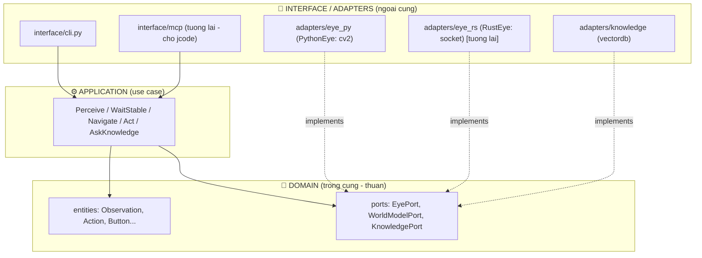

# Onmyoji Bot - Clean Architecture

> Refactor sang Clean Architecture de: (1) de su dung, (2) build duoc harness agent,
> (3) co the thay tang EYE (perception) bang Rust ma KHONG sua tang khac.

## Nguyen tac: phu thuoc huong VAO TRONG



**Quy tac vang:** mui ten phu thuoc chi tro VAO TRONG.
- `domain` khong import gi (khong cv2, khong socket).
- `application` chi import `domain`.
- `adapters`/`interface` import `application` + `domain`, va implement `ports`.

## Cau truc thu muc

| Path | Tang | Vai tro |
|------|------|---------|
| `contracts/schema.json` | - | Nguon chan ly: Observation/Action (Rust + Python deu theo) |
| `onmyoji/domain/entities.py` | Domain | Dataclass thuan, khop schema |
| `onmyoji/domain/ports.py` | Domain | Interface: EyePort, WorldModelPort, KnowledgePort |
| `onmyoji/application/use_cases.py` | Application | Perceive, WaitStable, Navigate, Act, AskKnowledge |
| `onmyoji/adapters/eye_py/python_eye.py` | Adapter | Boc Controller + perception.py thanh EyePort |
| `onmyoji/adapters/eye_py/fake_eye.py` | Adapter | FakeEye cho test offline |
| `onmyoji/interface/container.py` | Interface | Composition root (wiring) |
| `onmyoji/interface/cli.py` | Interface | CLI moi |
| `tests_arch/` | Test | Test kien truc, khong can game |

## Diem cot loi: swap EYE sang Rust

Ranh gioi EYE <-> phan con lai la `EyePort` + `contracts/schema.json`.

- **Hom nay:** `PythonEye` (cv2, ~85ms/frame: PNG decode 38ms + detect 47ms).
- **Mai:** `RustEye` noi chuyen voi `onmyoji-eye.exe` (native Windows, Graphics
  Capture + CV) qua socket localhost (~0.15ms RTT, da do thuc te voi networkingMode=mirrored).

Doi impl chi sua 1 cho: `container.build_eye()` (theo env `ONMYOJI_EYE`).
Use case / domain / harness KHONG doi 1 dong.

## Dung

```bash
# Test kien truc (khong can game)
.venv/bin/python tests_arch/test_architecture.py

# CLI voi fake eye (khong can game)
.venv/bin/python -m onmyoji.interface.cli --eye fake observe

# CLI voi game that (Windows + game chay)
.venv/bin/python -m onmyoji.interface.cli observe
.venv/bin/python -m onmyoji.interface.cli click 451 188
```

## Lo trinh

- [x] **B1**: contract + domain (entities, ports) + test
- [x] **B2**: PythonEye adapter (boc code cu) + FakeEye + CLI + container
- [ ] **B3**: WorldModelAdapter + KnowledgeAdapter (boc world_model.py, vectordb.py)
- [ ] **B4**: MCP/tool interface cho jcode (harness agent goi truc tiep)
- [ ] **B5**: `eye-rs/` Cargo crate (onmyoji-eye.exe) + RustEye adapter
- [ ] **B6**: Goal/reward model (objective_for moi mode tu KB)

## Vi sao khong viet lai harness bang Rust

Harness agent ~90% thoi gian la CHO LLM (network-bound). Rust khong giup phan do.
jcode (Rust harness co san) da co swarm/subagents/streaming. Ta CHI viet Rust cho
EYE (hot loop CPU + realtime). Xem cuoc thao luan: chi tang EYE can Rust.
