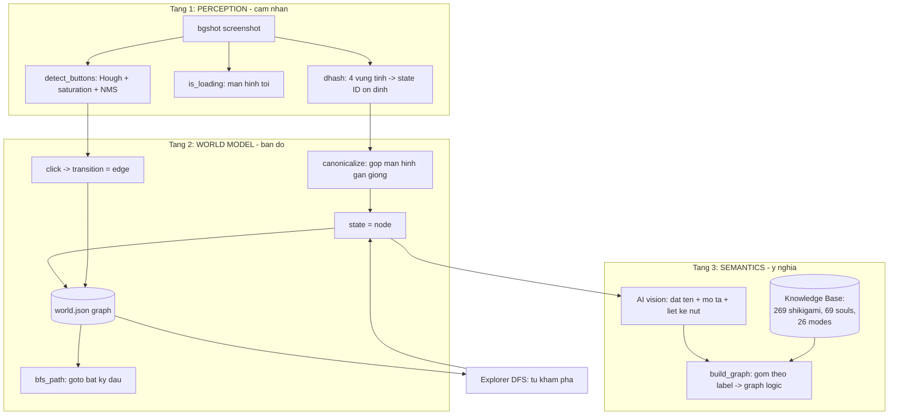

# Onmyoji Bot - Kien truc "Model hoc game" (Self-Learning Game Model)

> Muc tieu: bot TU HOC toan bo chuc nang game, thay vi hardcode template/toa do
> nhu OAS (OnmyojiAutoScript). OAS = con nguoi viet tay tung page + tung asset.
> Cua ta = bot tu kham pha graph + tu gan nghia + dung tri thuc KB.

## Tong quan 3 tang



## So sanh voi OAS

| Khia canh | OAS (hardcode) | Bot cua ta (tu hoc) |
|-----------|----------------|---------------------|
| Nhan dien page | template anh nguoi viet tay | dhash 4 vung tinh, tu sinh |
| Tim nut | toa do co dinh trong code | detect_buttons (CV) + hotspot seed |
| Ban do menu | con nguoi ve trong YAML | explorer DFS tu sinh graph |
| Y nghia nut | comment trong code | AI vision tu gan label/desc |
| Them tinh nang | sua code Python | chay explorer them -> tu cap nhat |

## Trang thai trien khai

DONE:
- T1 perception.py: dhash on dinh, is_loading, detect_buttons.
- T2 world_model.py: node+edge graph, canonicalize, bfs_path.
- T2 explorer.py: DFS sau, chong ket, bo qua loading.
- T3 label_states.py + build_graph.py: gan nghia + graph logic.
- KB: data/ (269 shikigami, 69 souls, 26 modes) + kb.py.

TODO / huong phat trien:
1. **Auto-label trong explorer**: moi state moi -> goi AI vision ngay (self-question
   "man hinh nay la gi? co nut gi?") thay vi label thu cong sau.
2. **OCR text**: doc chu tren nut (Explore/Summon/...) bang OCR -> label chinh xac hon
   ma khong can vision moi lan.
3. **Reward/goal model**: gan "muc tieu" cho moi mode (vd Realm Raid = farm soul) tu KB,
   de bot biet LAM GI o moi man, khong chi biet DI DAU.
4. **Toi uu toc do**: bgshot ~1.2s. Co the giu 1 PowerShell session song (pipe) thay vi
   spawn moi lan -> giam xuong <0.3s.
5. **Xu ly popup dong**: detect nut X cua popup (template do/hong tron) de tu dong dong.
6. **Persistent skill**: sau khi map xong, xuat thanh ui_graph/pages.yaml+edges.yaml
   cho graph.py dung (goto on dinh, khong can explore lai).

## Vong lap hoc (learning loop)

```
while chua phu het game:
    chup -> nhan state (T1)
    neu state moi: luu + AI gan nghia (T3)
    chon nut chua thu (detect_buttons T1)
    click -> quan sat ket qua -> ghi edge (T2)
    neu het cho moi o nhanh nay: BFS ve hub, sang nhanh khac
    dinh ky: build_graph -> graph logic + mermaid de nguoi xem
```
