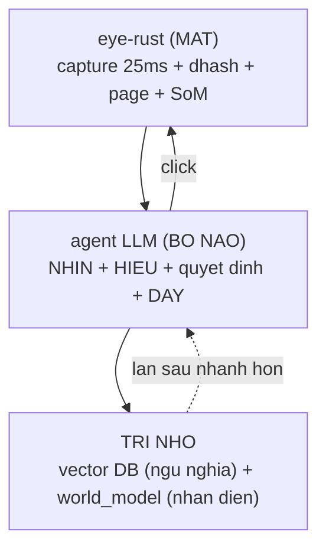

# Self-Learning Loop - Agent Vision + Exploration

> Bot TU HOC game qua agent LLM, KHONG hardcode kieu OAS. eye-rust = mat nhanh,
> agent LLM = bo nao hieu ngu nghia, vector DB + world_model = tri nho.

## Kien truc 3 thanh phan



## 2 nhiem vu cua eye-rust
1. **Control layer**: capture raw 25ms + dhash/buttons -> automation deterministic.
2. **Agent vision**: SoM (danh so element) + snap + screen-confirm -> agent nhan
   dang man + click chinh xac.

## Vong self-learning (MCP tools)

### Nhan dien man (3 tang, robust dan)
1. **dhash** (nhanh) -> match state da hoc (hamming<=12).
2. **page detector** (OAS landmark template, ~25ms) -> robust voi man DONG.
3. **agent vision** -> khi 2 tang tren "bi" (screen_confirmed=False), agent NHIN
   anh marked + tu nhan dien.

### LUU Y man DONG (dhash troi) - cach neo on dinh
Man DONG (HOME, Town, Exploration: nen 3D/nuoc/nhan vat animation) co dhash troi
30-40 bit MOI FRAME -> dhash KHONG dung lam neo (threshold 12 se nham man; do
Town<->Town 38 bit con xa hon Town<->HOME 19 bit). Cach neo on dinh theo do BEN:
- **Co page anchor** (HOME=page_main, Soul=page_soul_zones...): `canonical_state`
  neo qua page->label->node -> moi frame hoi tu 1 node logic. Recall ON DINH.
- **KHONG page anchor** (Town, Exploration chua co template): dung
  `learn_element(label, x, y, screen='Town')` - agent KHAI BAO ro man -> neo qua
  state_for_label('Town') -> element hoi tu dung node. KHONG bi phan manh khi hoc.
  + RECALL man dong khong page van phu thuoc dhash match -> co the khong on dinh
    (frame match node Town khac chua co element). FIX TRIET DE: them page template
    cho man do (tool gen_pages_embed) - viec lon, lam sau.

### Vong KHAM PHA (di het cay ban do)
```
explore_status()              # xem da map gi, con frontier gi, goi y buoc tiep
  -> observe_marked()         # NHIN man hien tai (SoM danh so element)
  -> [neu man co the keo] probe_scroll()  # man co scroll/keo? -> drag xem het content
  -> [neu man LA] learn_screen(label, function, farms)  # DAY ngu nghia -> vector DB
                  learn_element(label, x, y, screen=label)  # DAY toa do -> world_model
  -> click_at(x,y) / click_mark(id)   # click element CHUA thu -> sang man moi
  -> lap den khi frontier rong = phu het ban do
```

### Tools (16)
| Nhom | Tool |
|---|---|
| Nhin | observe, observe_marked |
| Lam | click, click_mark, click_at, polite_click, drag, key, goto |
| Do | **probe_scroll** (man co keo/scroll duoc khong - active motion probe) |
| Hoc | **learn_element** (toa do->world_model, co `screen` anchor), **learn_screen** (ngu nghia->vector DB + label) |
| Kham pha | **explore_status** (frontier + goi y) |
| Hoi | ask_kb (semantic search vector DB) |

## Nguyen tac SENIOR da ap dung
- **Marks = UNG VIEN, khong rang buoc**: CV co the sot/rac -> agent VERIFY tren
  anh goc, element sot thi click_at + snap.
- **Xac nhan man truoc khi khoanh verified**: man LA -> KHONG gop verified (tranh
  khoanh tum lum lam agent doc sai). screen_confirmed + screen_hint.
- **Tha thieu con hon rac**: loc box qua to, clamp bbox.
- **Self-learning, KHONG hardcode**: CV bootstrap, agent la ground-truth, he thong
  NHO 1 lan -> lan sau khong can hoi lai.

## Tri nho (persist)
- **vector DB**: knowledge/vectordb/learned.json (append-only, agent day) + index.pkl.
  build() gop KB goc + learned. search() ngu nghia.
- **world_model**: exploration/world.json - states{dhash,label,desc,verified_elements,
  buttons_tried} + edges. bfs_path theo node LOGIC (cung label).

## Trang thai
- DONE: eye-rust (capture/dhash/page/SoM/snap/motion), MCP 14 tools, self-learning
  (learn_element/learn_screen), vong kham pha (explore_status/frontier).
- 12 arch test + 20 eye-core + 8 bin Rust + e2e xanh.
- TODO: chay vong kham pha THAT voi agent de lam day vector DB + graph.
