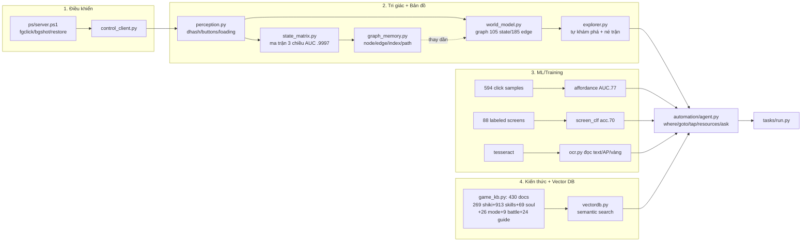

# HỆ THỐNG Onmyoji Bot - Tổng quan (build xong, sẵn sàng học tối nay)

> Đọc `knowledge/LEARNINGS.md` để biết MỌI bài học chi tiết. File này = bản đồ hệ thống.

## 4 hệ thống đã xây

## Lệnh nhanh (đều dùng .venv/bin/python)

| Việc | Lệnh |
|------|------|
| Tổng kết kiến thức | `cat knowledge/LEARNINGS.md` |
| Tra cứu KB | `python knowledge/game_kb.py stats\|shikigami <q>\|soul <q>\|skill <name>\|mode <q>` |
| Hỏi KB (ngữ nghĩa) | `python knowledge/vectordb.py query "câu hỏi"` |
| Train lại ML | `python ml/train.py` |
| Khám phá game | `python -u scripts/explorer.py 300` (game phải chạy) |
| Agent: đang ở đâu | `python automation/agent.py where` |
| Agent: đi tới màn | `python automation/agent.py goto HOME` |
| Agent: đọc tài nguyên | `python automation/agent.py resources` |
| Agent: hỏi KB | `python automation/agent.py ask "best ATK soul"` |
| Chạy task | `python tasks/run.py daily_signin` |

## Số liệu hiện tại
- **Graph UI**: 105 state vật lý, 185 edge, 18 chức năng game logic.
- **KB**: 430 documents (269 shikigami + 913 skills + 69 souls + 26 modes + 9 battle + 24 guide + 18 screen + ...).
- **ML**: affordance AUC 0.765, screen classifier acc 0.697 (vượt baseline rõ rệt).
- **Vector DB**: TF-IDF 430 docs, vocab ~30k, trả lời ngữ nghĩa tốt.

## Việc cho phiên live tới (khi game chạy)
1. Sanity-check trước MỌI experiment: `bgshot` trả ảnh? đồng hồ OCR chạy? (LEARNINGS §15 - ảnh stale).
2. Chạy `map_loop.sh` với explorer mới (đã ghi edge back) → graph 2 chiều, đẩy 38→50+ node.
3. Nối explorer observe() vào `graph_memory.py` (thay fingerprint Jaccard 1 chiều).
4. Task farm thật đầu tiên: realm_raid (xem `knowledge/game_tasks.json` priority) - DRY trước, `--live` sau.
5. Experiment Bonus/foreground chạy LẠI (kết quả cũ vô hiệu vì ảnh stale).
