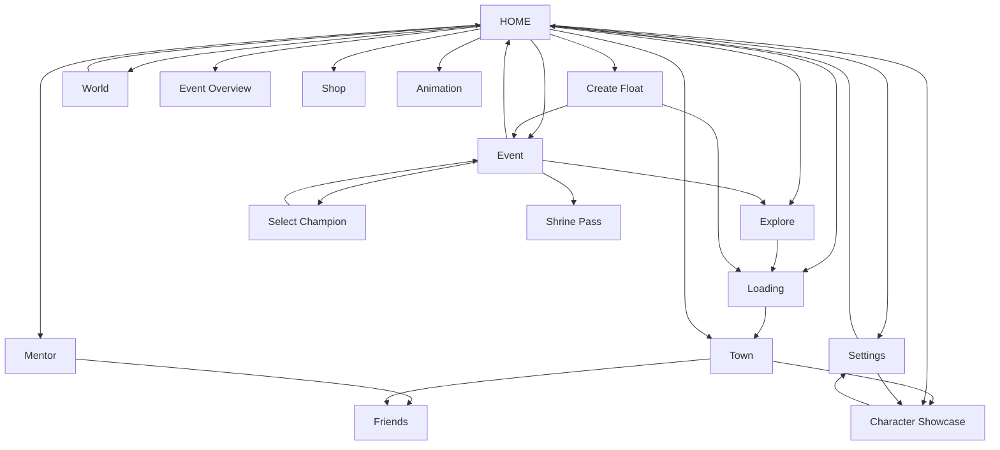

# Onmyoji UI Graph (logical)

Nodes: 18  Edges: 28

## Nodes

- **HOME** (x23 physical): Home courtyard radial menu | Home radial menu | Home with character switch menu | Home with switch menu | Main courtyard home | Main home courtyard | San nha | San nha (chat the gioi) | San nha (dem) | San nha (nut Yard goc trai duoi) | San nha (thong bao Nurikabe Shard) | San nha (thong bao Soul DEF Bonus) | San nha (thong bao trieu hoi SP) | San nha + side panel (Forum/Support) | San nha chinh
- **Event** (x16 physical): Awakened Wisdom event overview | Ban do su kien Awakened Wisdom (cac che do) | Champion Trial cua su kien | Event Overview listing | Frozen Treasure event detail | Melodic Mastery (nang cap ky nang) | Return Benefits sign-in rewards | Spring Parade mileage | Spring Parade mileage track | Spring Parade multiplayer carts | Wanted Quests bounty list | Wisdom Ignited Shard tab | Wisdom Ignited story Main tab
- **Character Showcase** (x9 physical): Acc & SFX customization | Nameplate upgrade popup | Shikigami showcase selection | Shikigami showcase skin variants | Showcase character/skin selection | Showcase courtyard empty stage | Showcase selection panel | Showcase setup | Showcase setup skin selection
- **Settings** (x6 physical): Bang cai dat (Audio/ho so/tai khoan) | Chon khung vien avatar | Cua so chon khung vien avatar (Frame) | Hop thoai lien ket tai khoan (nhan 50 Jade) | Settings My Birthday popup | Trinh phat nhac nen
- **Loading** (x5 physical): Loading splash | Man hinh tai (logo + chuot) | Man hinh tai (logo + miko) | Man hinh tai (nui + trang) | Startup splash
- **Explore** (x5 physical): Chapter map near Six Realms Gates | Chapter map with chapters 26-28 | Explore map Another Seimei | Explore map quest locations | Stage challenge panel Doujo boss
- **Animation** (x4 physical): Cinematic card butterfly wings | Cinematic card cutscene | Cinematic pagoda night | Story cutscene with Skip
- **Shikigami** (x4 physical): Shikigami collection grid | Shikigami collection list
- **Shrine Pass** (x3 physical): Mystic Scroll quest reward track | Shrine Pass purchase confirm popup | Shrine Pass reward track
- **Town** (x2 physical): Town district: Arena, Demon Parade, Mystic Trader | Yard/courtyard night scene
- **Friends** (x2 physical): Chat panel World/Guild/Team | Player profile card popup
- **Event Overview** (x2 physical): Skin shop new skins | Worldly Guardian skin preview
- **Mentor** (x1 physical): Mentor's Guidance apprentice recommendation
- **Select Champion** (x1 physical): Champion selection
- **Create Float** (x1 physical): Float creation: name/greeting
- **World** (x1 physical): World chat / team recruitment
- **Shop** (x1 physical): Acc & SFX entrance effects
- **Summon** (x1 physical): Summon Room Wisdom Flames

## Transitions

- HOME --click [59, 89]--> Settings
- HOME --click [1077, 176]--> Event
- HOME --click [698, 209]--> Loading
- HOME --click [608, 192]--> Explore
- Explore --click [743, 581]--> Loading
- Loading --click [739, 218]--> Town
- Town --click [1045, 575]--> Character Showcase
- HOME --click [970, 387]--> Mentor
- Event --click [77, 157]--> Select Champion
- Select Champion --click [583, 244]--> Event
- HOME --click [1076, 373]--> Create Float
- Create Float --click [59, 56]--> Loading
- Mentor --click [721, 167]--> Friends
- HOME --click [445, 111]--> World
- World --click [1077, 175]--> HOME
- Event --click [47, 65]--> HOME
- HOME --click [1019, 589]--> Character Showcase
- Event --click [955, 601]--> Shrine Pass
- Settings --click [437, 238]--> Character Showcase
- Character Showcase --click [272, 181]--> Settings
- Event --click [929, 267]--> Explore
- Create Float --click [734, 455]--> Event
- HOME --click [1081, 458]--> Event Overview
- HOME --click [89, 579]--> Town
- Town --click [187, 80]--> Friends
- HOME --click [806, 453]--> Shop
- Settings --click [992, 119]--> HOME
- HOME --click [734, 595]--> Animation

## Mermaid

