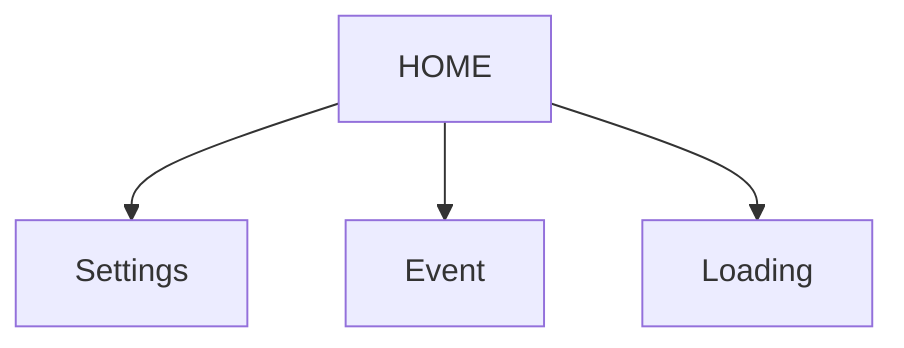

# Onmyoji UI Graph (logical)

Nodes: 4  Edges: 3

## Nodes

- **HOME** (x11 physical): San nha | San nha (chat the gioi) | San nha (dem) | San nha (nut Yard goc trai duoi) | San nha (thong bao Nurikabe Shard) | San nha (thong bao Soul DEF Bonus) | San nha (thong bao trieu hoi SP) | San nha + side panel (Forum/Support) | San nha chinh
- **Settings** (x5 physical): Bang cai dat (Audio/ho so/tai khoan) | Chon khung vien avatar | Cua so chon khung vien avatar (Frame) | Hop thoai lien ket tai khoan (nhan 50 Jade) | Trinh phat nhac nen
- **Event** (x4 physical): Awakened Wisdom event overview | Ban do su kien Awakened Wisdom (cac che do) | Champion Trial cua su kien | Melodic Mastery (nang cap ky nang)
- **Loading** (x3 physical): Man hinh tai (logo + chuot) | Man hinh tai (logo + miko) | Man hinh tai (nui + trang)

## Transitions

- HOME --click [59, 89]--> Settings
- HOME --click [1077, 176]--> Event
- HOME --click [698, 209]--> Loading

## Mermaid

