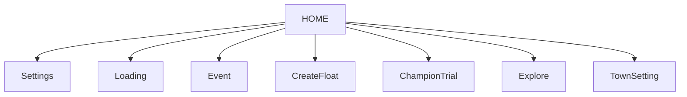

# Onmyoji UI Graph (logical)

Nodes: 8  Edges: 7

## Nodes

- **HOME** (x15 physical): San nha | San nha (footer menu hien) | San nha (footer menu) | San nha (tooltip Switch characters) | San nha + side panel trai (Forum/Support/Yard) | San nha chinh
- **Loading** (x2 physical): Frame chuyen canh (dang vao Awakened Wisdom) | Frame chuyen canh toi mau
- **Settings** (x1 physical): Bang cai dat / ho so nguoi choi (Audio/View/Name/Code)
- **Event** (x1 physical): Trang su kien (Awakened Wisdom event overview)
- **CreateFloat** (x1 physical): Man hinh tao xe dieu hanh (Create Float)
- **ChampionTrial** (x1 physical): Champion Trial (Successor Trial/Fujiwara Archives/Uncharted Dreams)
- **Explore** (x1 physical): Ban do Explore/Chapter (Realm Raid/Soul/Secret Zone)
- **TownSetting** (x1 physical): Popup cai dat Town (Original/Normal/Extreme)

## Transitions

- HOME --click [64, 77]--> Settings
- HOME --click [694, 213]--> Loading
- HOME --click [1077, 175]--> Event
- HOME --click [229, 463]--> CreateFloat
- HOME --click [1077, 242]--> ChampionTrial
- HOME --click [608, 192]--> Explore
- HOME --click [660, 277]--> TownSetting

## Mermaid

