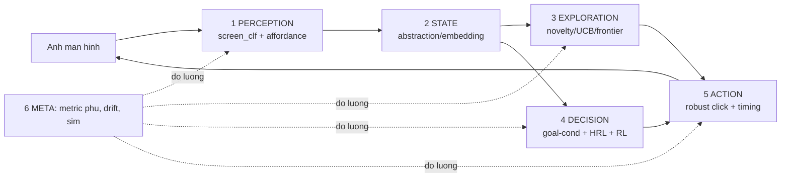

# BAI TOAN NGHIEN CUU: GIUP BOT & AGENT HOC (2026-06-05)

Tai lieu DINH HUONG dai han. Khong ly thuyet suong: moi bai toan gan voi
TINH HUONG THUC cua bot nay + data da co + file da ton tai trong repo.

Trang thai hien tai (do duoc): 37 node graph sach, 26 edge, 200 transition
sample (logs/explore_*.jsonl), da co ml/affordance.py (GBM click-co-tac-dung),
automation/state_solver.py (Q-learning theo state-sig), automation/maze_bench.py
(learning curve + version gain). Window off-screen DA FIX (movewin).
Model da train san: ml/models/affordance.pkl, ml/models/screen_clf.pkl.

## 0. PIPELINE AGENT (cac bai toan gan vao tung khau)

================================================================
## 1. PERCEPTION (nhin) - hieu man hinh
================================================================

### 1.1 Screen classification (bai toan: phan loai LOAI man)
- Van de thuc: text_signature tho nhay nhieu OCR -> node trung lap (loading).
- Bai toan: f(image) -> {home, menu, battle, popup_reward, dialog, loading,
  result, shop, soul_realm, exploration...}. Supervised classification.
- Data: chup man + nhan (tu graph label da co 1 phan). ml/screen_clf.py da co khung.
- Huong: CNN nhe HOAC feature thu cong (dhash + OCR token + mau vung) + GBM.
  Metric: macro-F1 tren tap nhan tay; nham lan loading<->thuong la KPI chinh.

### 1.2 Affordance detection (bai toan: cho nao click DUOC + dan dau)
- Da co ml/affordance.py: GBM du doan 'click (x,y) co tac dung khong' (noop?).
- Mo rong: tu (vung,mau,hinh dang,context) du doan LOAI nut: nav/banner/close/
  buff/confirm. -> bot tu hoc 'icon goc phai = banner 85%, skip' thay hardcode MENU_WORDS.
- Data san: 200 transition (try/edge + noop) = nhan san cho 'co tac dung'.
- Bai toan kho: object detection nut KHONG co chu (hien dung CV contour _icon_blobs).
  Co the dung template matching / small detector (YOLO-nano) neu can do chinh xac.

### 1.3 Grounding text<->action (OCR token -> y dinh)
- OCR hay dinh/lech ('Tapto continue', 'onmyojil'). Bai toan chuan hoa + map
  token -> khai niem game (summon/soul/explore). Co the fuzzy + tu dien hoc dan.

================================================================
## 2. STATE REPRESENTATION (bieu dien trang thai)
================================================================

### 2.1 State abstraction (bai toan: 2 anh = cung trang thai?)
- Da co same_screen (Jaccard token + dhash hamming). Van de: loading, OCR nhieu.
- Bai toan nghien cuu: hoc embedding man hinh (contrastive/SimCLR) sao cho 2 anh
  cung-man gan nhau, khac-man xa. -> robust hon luat tay.
- Re hon: tinh chinh nguong same_screen bang DATA (label cap anh cung/khac man).

### 2.2 State aliasing & partial observability (POMDP)
- Van de thuc: 2 man trong KHAC NHAU nhung OCR giong (vd 2 popup reward khac noi
  dung). Hoac cung man nhung animation doi dhash. Day la POMDP: quan sat khong
  du xac dinh trang thai.
- Huong: belief state / lich su ngan (man truoc + action) lam context.

================================================================
## 3. EXPLORATION (kham pha) - bai toan trung tam hien tai
================================================================

### 3.1 Exploration co dinh huong (thay DFS mu)
- Da co: DFS + frontier-driven + escape_to_home. Han che: phi thoi gian o popup.
- Bai toan: Maximum Coverage / Graph exploration online. Muc tieu phu HET man THAT
  voi it click nhat. Lien quan: Canadian Traveller / online graph discovery.
- Huong thuat toan:
    * Novelty/count-based bonus: uu tien cand dan toi state ITS DA THAY.
    * UCB tren cand: balance khai thac (menu chac an) vs kham pha (cand la).
    * Frontier value = uoc luong so man-moi sau cand do (hoc tu lich su).

### 3.2 Intrinsic motivation (tu thuong khi kham pha)
- RND (Random Network Distillation) / ICM: thuong khi gap state 'la' (predict error
  cao). Phu hop game khong co reward ngoai. -> bot to mo MOT CACH CO HE THONG.

### 3.3 Active learning (chon hanh dong giam BAT DINH nhat)
- Khi affordance model khong chac 1 nut -> uu tien THU nut do (thu thap nhan).
  Vong lap: explore -> sample -> retrain affordance -> explore tot hon.

================================================================
## 4. DECISION / PLANNING (ra quyet dinh)
================================================================

### 4.1 Goal-conditioned navigation (da co 1 phan: _bfs_path)
- Bai toan: cho goal-predicate (vd 'man co Soul+Challenge'), tu navigate qua graph.
- Da co BFS tren edge da biet. Mo rong: A* voi heuristic = do tuong dong token
  toi goal. Neu chua co duong -> explore huong goal (frontier gan goal nhat).
- automation/maze_bench.py DA do learning curve Dijkstra/A* + EdgeStats -> tai dung.

### 4.2 Hierarchical RL (HRL) - option/skill
- Game co cau truc PHAN CAP: 'mo Soul' = chuoi (explore->soul realm->chon->challenge).
- Bai toan: hoc OPTION (macro-action) tai su dung. Vd skill 'dismiss_all_popups',
  'goto_home', 'start_one_battle'. Da co manh moi (escape_to_home, farm.py battle FSM).

### 4.3 MDP/RL voi reward thua (sparse) + reward shaping
- state_solver.py DA dung Q-learning + shaping (token-dich tang -> +shaping).
- Bai toan: thiet ke reward tot (daily done? soul farmed? it click?). Tranh
  reward hacking (bot spam click banner de 'kham pha').

================================================================
## 5. ACTION / CONTROL (thuc thi)
================================================================

### 5.1 Robust clicking (B2 da fix goc: movewin)
- Con lai: thu tu fallback bgclick->politeclick->fgclick + verify. Hoc method NAO
  hop loai-nut-nao (footer can polite, nav text can bg) = bandit nho per affordance.

### 5.2 Timing / wait-stable (bai toan: doi bao lau sau click?)
- Hien sleep co dinh 1.6s. Bai toan: du doan thoi gian on dinh man (loading lau/nhanh)
  -> doi dong (poll dhash on dinh). Tiet kiem thoi gian + tranh doc man dang chuyen.

================================================================
## 6. META / EVALUATION (do luong viec hoc)
================================================================

### 6.1 Metric do PHU game (khong chi dem node)
- Da rut ra: so node != do phu. Can: % man-THAT cham, % menu-chinh mo, edge/node
  optimal. maze_bench.py co khung learning-curve -> ap cho explorer that.

### 6.2 Regression / lifelong learning (khong quen khi game cap nhat)
- Game doi UI theo event. Bai toan: phat hien drift (man cu khong match) + cap nhat
  graph ma KHONG xoa kien thuc dung (continual learning, tranh catastrophic forgetting).

### 6.3 Sim-to-real & reproducibility
- automation/maze_sim.py mo phong me cung -> test thuat toan NHANH khong can game.
  Bai toan: dam bao thuat toan tot tren sim van tot tren game that.

================================================================
## 7. LO TRINH NGHIEN CUU DE XUAT (theo ROI, gan data hien co)
================================================================
1. [PERCEPTION] 1.1 screen_clf + auto-dismiss popup -> sach state, giam node rac.
   (data: nhan tay ~50 shot tu logs/explore_shots; ml/screen_clf.py san).
2. [EXPLORATION] 3.1 novelty/UCB ordering thay DFS -> phu nhanh hon. Do bang
   metric 6.1 (% man that / click). Sim truoc bang maze_bench.
3. [ACTION] 5.1 affordance-guided click + 5.2 wait-stable dong -> it noop, nhanh.
   (data: 200 transition + bo sung).
4. [DECISION] 4.1 goal-conditioned (BFS->A*) + 4.2 option 'goto/farm' -> tu lam
   nhiem vu (daily/soul) thay vi chi map.
5. [META] 6.1 metric phu + 6.2 drift detect -> ben vung khi game cap nhat.

NGUYEN TAC: moi buoc PHAI co metric do duoc (vd macro-F1, %phu/click, noop-rate,
buoc/optimal) + validate tren SIM truoc khi chay game that (tiet kiem thoi gian).
Vong lap nghien cuu: gia thuyet -> do baseline -> sua -> do lai -> ghi LEARNINGS.
